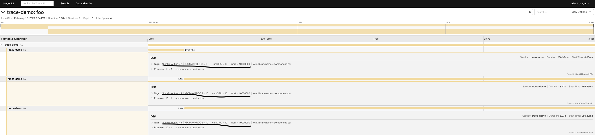

# Relationship between Goroutines, Pods, and Underlying Node CPU

## Build and run the code to determine the relationship between goroutines and CPU's

1. Clone the opentel repo
    ```
    git clone https://github.com/open-telemetry/opentelemetry-go.git
    ```
2. Clone this repo
    ```
    https://github.com/Vodafone/rubik-sandbox.git
    ```
3. Copy the amended main.go - this creates a busy loop of iterations of work and adds some parameretisation
    ```
    cp rubik-sandbox/main.go  opentelemetry-go/example/jaeger/main.go
    ```
4. change working directory
    ```
    cd opentelemetry-go/example
    ```
5. Build
    ```
    go build
    ```
6. Install jaeger locally (I use podman instead of docker - your choice)
https://www.jaegertracing.io/docs/1.6/getting-started/
    ```
    podman run -d --name jaeger  -e COLLECTOR_ZIPKIN_HTTP_PORT=9411  -p 5775:5775/udp  -p 6831:6831/udp  -p 6832:6832/udp  -p 5778:5778  -p 16686:16686  -p 14268:14268  -p 9411:9411 jaegertracing/    all-in-one:1.6
    ```
7. Check the jaeger UI http://localhost:16686/
run the go program locally and send the span info to jaeger
## this executes a busyloop of (-i) 10,000,000 iterations, followed by (-g) 1 goroutine also doing 10,000,000 iterations of busywork
    ```
    ./jaeger -j http://localhost:14268/api/traces -i 10000000 -g 1 
    ```

## this executes a busyloop of (-i) 10,000,000 iterations, followed by (-g) 2 goroutine also doing 10,000,000 iterations of busywork
    ```
    ./jaeger -j http://localhost:14268/api/traces -i 10000000 -g 2 
    ```

## Interpretation
One possible interpretation of this, because when more goroutines are added doing the same work the time to execute overall gets longer, is that the goroutine scheduler is smart enought to distribute the work across all CPU's. Rather than each goroutine being somehow bound to a CPU. This is also described in various publications. This is no problem


# Now lets try the same thing in a GKE cluster
1. Build the code for linux
    ```
    env GOOS=linux GOARCH=amd64 go build
    ```
2. Create a GKE cluster, any cluster regular or autopilot - doesn't matter. Mine is a 3 node cluster of e2-standard-16
3. Install Opentel as per the istructions here: https://medium.com/@akashjoffical08/implement-distributed-tracing-with-jaeger-opentelemetry-on-kubernetes-3e35cb77b536
   We only need to go as far as jaeger, as our code will send directly to the jaeger collector service rather than via the opentel collector
   Port forward to the jeager UI
   ```
   kubectl port-forward svc/jaeger-query 8091:80 -n jaeger
   ```
   Check UI is working http://localhost:8091/
4. Create a namespace otel-tests
   ```
   kubectl create ns otel-tests
   ```
5. Deploy an alpine pod with 2CPU limits and a sleep forever so it doesnt die
   ```
   kubectl apply -f mypod.yaml
   ```
6. We should now have an alpine pod running in the otel-tests namespace and jeager all installed and running
7. Copy the executable, built for linux to the (only) container in the pod
   ```
   k -n otel-tests cp jaeger mypod:/jaeger
   ```
8. exec into the pod and chmod the executable
   ```
   k -n otel-tests exec -it mypod -- /bin/sh
   chmod +x jaeger
   ```
9. test that we can send traces to jaeger and see them - note we now configure the jaeger collector to the service
    ```
    ./jaeger -j http://jaeger-collector.jaeger.svc.cluster.local:14268/api/traces -i 10000000 -g 1
    ```
    

##Notice that Go thinks it has 16CPU's - which is the spec of the node, but the pod limit was 2 CPU's

# EXAM QUESTION
**What is the relationship between the CPU the go scheduler in a container thinks it has vs the CPU limit on the pod vs the CPU on the physical node**

If we run a soak test, will go have available to it all CPU available to the undelying node - as indicated by the diagram above, or will it respect the CPU limits set in the POD. How does it work?

Make a note of the node that the test pod is running on and use the GCP console to check utilisation
    ```
    k -n otel-tests get po -owide
    ```

Run a large test -10 billion - control-c when we have collected the evidence from the GKE node utilisation
    ```
    ./jaeger -j http://localhost:14268/api/traces -i 10000000000 -g 2 
    ```
The CPU on the nodelooks under-utilised


GKE View
    
VM View
    
